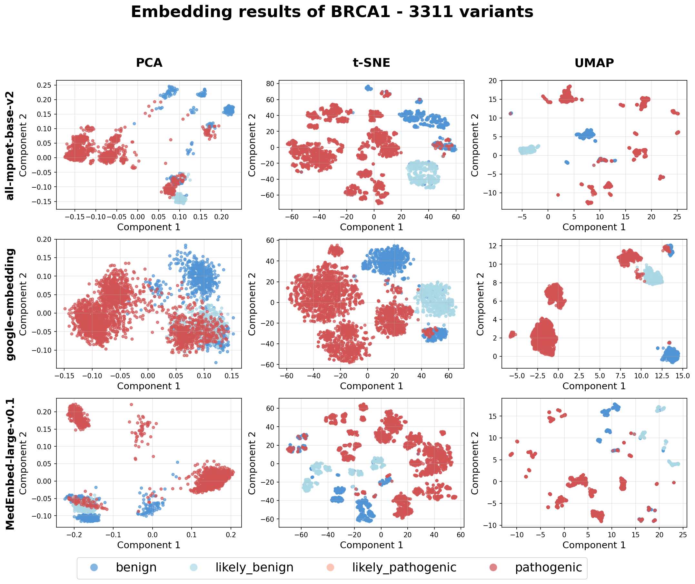
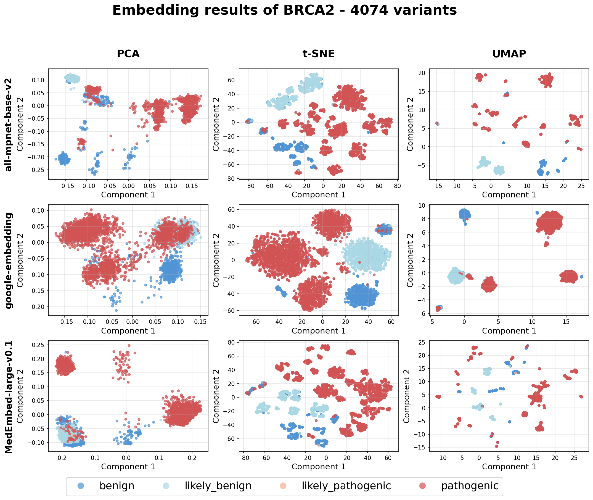
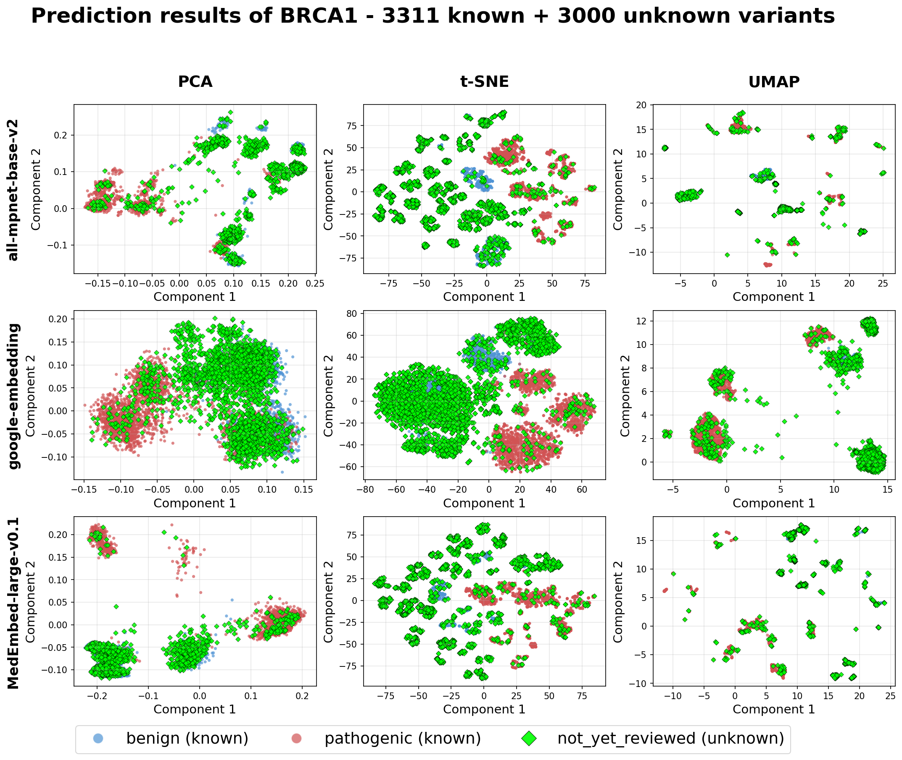
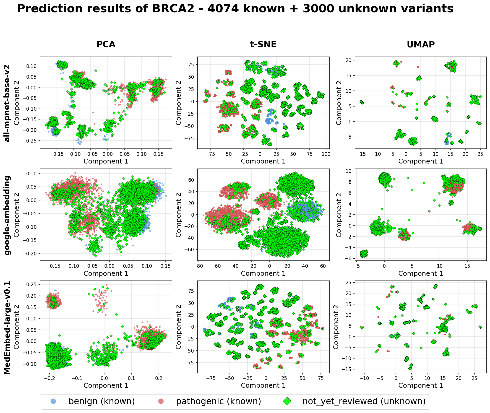
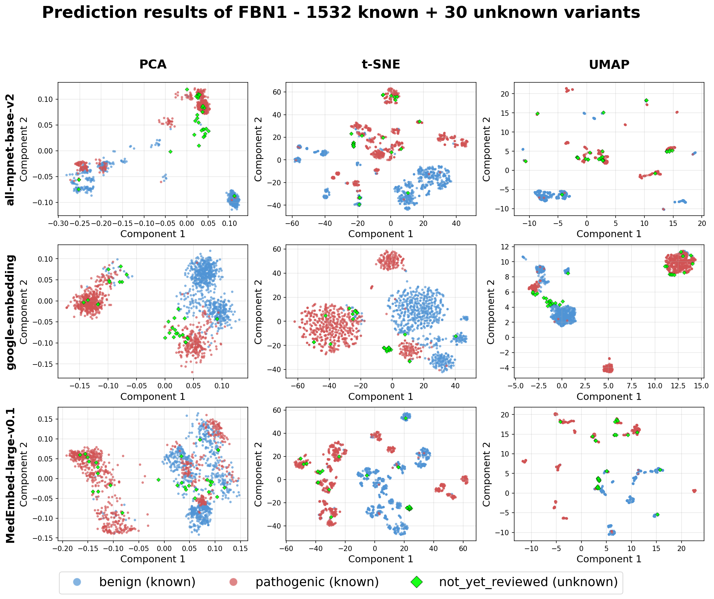

# **Leveraging Vector Embeddings for Rapid and Accurate Pathogenicity Prediction of Genetic Variants**

We proposed a novel framework called **VUS.Life** for predicting the pathogenicity of genetic variants by transforming their annotations into vector embeddings.

## **Summary of VCF Embedding Methodology**

1. **Variant Annotation:** The process begins with variants from genes such as *BRCA1*, *BRCA2*, and *FBN1*. These variants are annotated using the Ensembl Variant Effect Predictor (VEP). The VEP configuration is designed to capture a comprehensive range of information, including core annotations (e.g., predicted consequence, protein-level effects), scores from established pathogenicity predictors (e.g., CADD, REVEL, AlphaMissense), and functional annotations (e.g., Gene Ontology terms).

2. **Text Conversion:** The structured JSON output from VEP is converted into a consistent, semi-structured textual format. This is done using a custom template that organizes the nested data into a human-readable, key-value report. This step ensures that all features, including numerical scores and identifiers, are unified into a single text string, making it suitable for processing by language models.

3. **Semantic Embedding Generation:** The textual descriptions for each variant are then processed by three distinct pre-trained large language models to generate high-dimensional vector embeddings:

   - **all-mpnet-base-v2 (MPNet):** A Transformer-based model for general semantic similarity tasks.

   - **MedEmbed-large-v0.1:** A domain-specific Transformer model trained on biomedical literature for a more nuanced understanding of medical and genomic terminology.

   - **text-embedding-004 (Google Embeddings):** A state-of-the-art, general-purpose embedding model.

4. **Dimensionality Reduction and Visualization:** To visualize and analyze the high-dimensional embeddings, three dimensionality reduction techniques are applied: Principal Component Analysis (PCA), t-Distributed Stochastic Neighbor Embedding (t-SNE), and Uniform Manifold Approximation and Projection (UMAP). These methods project the embeddings into a two-dimensional space to reveal clustering patterns based on pathogenicity.

## **Summary of VUS.Life Visualization Results**

### 1.1 Embedding Result of BRCA1 and BRCA2

The VUS.Life framework demonstrates a powerful ability to distinguish between pathogenic and benign genetic variants by representing them in a semantic vector space. For the well-characterized genes *BRCA1* and *BRCA2*, dimensionality reduction of the variant embeddings reveals a clear and highly separable clustering pattern. As shown in **Figure 1** and **Figure 2**, benign variants (blue) and pathogenic variants (red) form distinct, well-defined groups, with non-linear techniques like t-SNE and UMAP illustrating particularly tight and separated clusters. This indicates that the semantic embeddings effectively capture the complex features that determine a variant's clinical significance.

**Figure 1.** **Dimensionality reduction of semantic embeddings for 3,311 BRCA1 variants.** Each panel displays a 2D projection of the high-dimensional variant embeddings using three different models (rows: all-mpnet-base-v2, google-embedding, MedEmbed-large-v0.1) and three dimensionality reduction techniques (columns: PCA, t-SNE, UMAP). The distinct separation between benign (blue) and pathogenic (red) variants across all models demonstrates that the embeddings effectively capture pathogenicity-relevant features. Non-linear methods like t-SNE and UMAP reveal more defined clusters compared to the linear PCA projection, confirming the semantic space is structured by clinical significance.

**Figure 2: Visualization of semantic embeddings for 4,074 BRCA2 variants.** Following the same structure as Figure 1, these plots show the embedding space for *BRCA2* variants. The separation between benign (blue) and pathogenic (red) classes is even more pronounced than for *BRCA1*, with t-SNE and UMAP revealing highly compact and well-separated clusters, suggesting a very robust semantic representation.

### 1.2 Prediction Result of Not-Yet-Reviwed Variants

When the framework was applied to a test set of not-yet-reviewed variants in *BRCA1* and *BRCA2*, the results were equally compelling. As seen in **Figure 3** and **Figure 4**, these unknown variants (green) do not scatter randomly. Instead, they overwhelmingly fall into the established benign or pathogenic clusters, aligning spatially with the known variants. This demonstrates the framework's strong predictive potential, as the position of an unknown variant within the semantic space provides a clear indication of its likely pathogenicity.

**Figure 3: Visualization of pathogenicity of 3000 not-yet-reviewed variants (highlighted as green diamonds) on BRCA1.** The pathogenicity is simply mapped into binary labels: benign and pathogenic. Each panel displays dimensionality reduction (PCA, UMAP, and t-SNE) of variant embeddings. The consistent spatial distribution of unknown variants relative to known benign and pathogenic variants across models and genes suggests that embeddings effectively capture pathogenicity-related semantics.

**Figure 4: Visualization of pathogenicity of 3000 not-yet-reviewed BRCA2 variants.** The same pattern as *BRCA1* prediction. This figure shows that unknown variants in *BRCA2* also align closely with the established benign (blue) and pathogenic (red) clusters, reinforcing the framework's predictive accuracy and reliability.

### 2.2 Embedding Results of FBN1

To validate the generalizability of this approach beyond these well-studied cancer-predisposition genes, the analysis was extended to *FBN1*, a gene associated with Marfan syndrome. **Figure 5** shows that the same distinct separation between benign and pathogenic clusters is maintained for *FBN1* variants. This confirms that the methodology is robust and its utility is not limited to a specific gene or disease mechanism.

To further test the framework's predictive power in a clinically challenging context, its performance was evaluated on 30 highly challenging FBN1 variants that were part of a pilot study by the ClinGen FBN1 Variant Curation Expert Panel (VCEP). These variants were difficult for human experts to classify, even with new gene-specific guidelines. As shown in **Figure 5**, the VUS.Life framework successfully segregated these 30 unresolved variants into the established pathogenic or benign clusters.The model's predictions showed an 85% agreement with the VCEP's classifications. Critically, for 10 variants that the VCEP had classified as Variants of Uncertain Significance (VUS), the algorithm confidently resolved them, classifying 7 as pathogenic and 3 as benign. In the few cases of disagreement, public databases like ClinVar also listed the variants as VUS, highlighting the extreme difficulty of their interpretation and suggesting the model may be capturing subtle pathogenic signals missed by manual curation.

Figure 5: Validation of the semantic embedding framework's generalizability using 1,532 FBN1 variants with 30 test variants. 