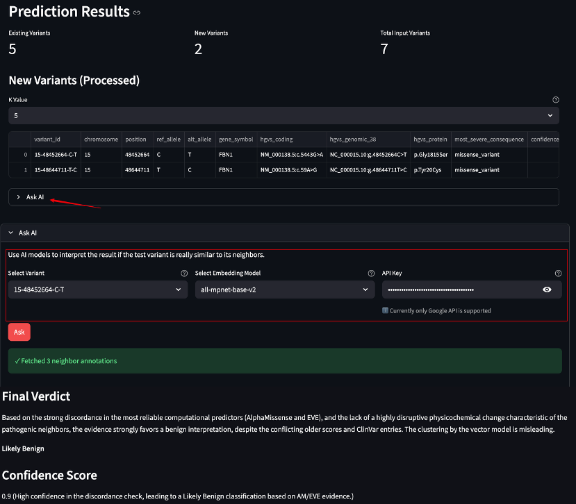

# VUS.LIFE Web App User Guide

## Overview

This application provides variant pathogenicity prediction and embedding visualization for genetic variants using machine learning models. 

**Access the app here:** [http://52.54.223.114:8501/](http://52.54.223.114:8501/)

---

## Important Usage Notes

### 1. Input Format Requirements

- Currently accepts only **g. annotation format** (genomic notation)
- **Variants must be from the same gene** in a single query
  - ✅ Example: Query BRCA1 variants separately from BRCA2 variants
  - ❌ Do not mix variants from different genes

### 2. Query Limitations

- Please limit your input to **maximum 10 variants per query**
- While the app won't crash with more variants, processing time will significantly increase

### 3. Gene Selection

- On the preview input page, verify that your **selected gene in the sidebar matches the gene in your uploaded variants**
- This is crucial for accurate predictions

### 4. Processing

- Click **"Process Variants"** to start the prediction

### 5. Results Interpretation

The results page contains two sections:

- **Existing Variants**: Variants from your input that already exist in the training dataset with known pathogenicity labels
- **New Variants**: Variants from your input not present in the training dataset, which will be predicted as having unknown pathogenicity

**New Feature! Ask AI (AI Interpretation)**

- Expand the **Ask AI** section on the results page to get a second-opinion interpretation of the embedding-based prediction.
- **Select variant of interest**: Choose the variant you want the AI to analyze (it will compare it against its neighbor variants).
- **Available model**: Goolge's latest flash model.
- **API key**: Enter your **Google API key**. Get your API key here: [Gemini API – Google AI for Developers](https://ai.google.dev/gemini-api/docs).
- Click **Run** to start the analysis. The AI will perform a discordance check and return a verdict with mechanism analysis, score concordance, and red flags (if any).

### 6. Embedding Plot

- View the 2D spatial distribution of your input variants' mathematical representations
- This visualization shows how known variants cluster in the embedding space

---

## Test Data

Test data files are available for **BRCA1**, **BRCA2**, and **FBN1** genes.

### Important Notes:

- The provided files contain hundreds of variants
- **Recommended**: Select approximately 10 variants and save them to a `.txt` file for testing

---

## Feedback & Support

Thank you for trying this app! Your feedback and comments are greatly appreciated. 

If you encounter any issues, please feel free to contact me or open an issue on this repository.
